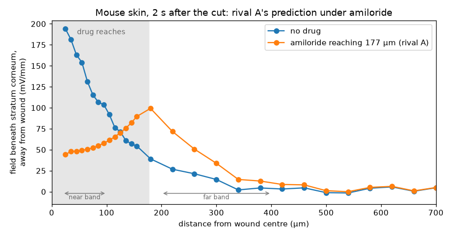

# galvanomics: amiloride and the skin wound field, what would decide between the explanations

Written 2026-10-08, from the model runs recorded in `docs/plan.md` (H1, R1–R4, R1b–R4b, the instrument finding). Machine-checked, not human-confirmed. This memo is for an experimental partner; nothing in it has been tested against a new measurement.

## The puzzle

Topical 1 mM amiloride reduced the electric field at mouse skin wounds by 64 ± 7% (mean ± SEM, 11 wounds; Nuccitelli et al. 2008, Wound Repair Regen, PMC3086402). The skin model was calibrated only on the intact skin battery, a Na-only battery from apical ENaC in the granular layer. It predicted 97% (H1). At 1 mM, 24,000 times amiloride's K_i on ENaC, the block is complete wherever the drug reaches. So something carries about a third of the field that amiloride does not remove, or the drug does not reach the whole field-generating region.

## Explanations examined

| Explanation | Status in the model | Basis |
| --- | --- | --- |
| **Limited drug access**: amiloride reaches only cells near the wound | **fits**: a block confined to about 170–180 µm from the wound centre reproduces 64%, with keratinocytes at the model's −73 mV or depolarized to the cultured −32 mV | R1, R1b |
| **Apical Cl⁻ secretion** (the original authors' "Cl⁻ efflux") | **not modelled**, against the sources | no basolateral Cl⁻ loader is documented in the granular layer (NKCC1 reported absent from epidermis), and keratinocyte [Cl⁻]i of 6.8 mM drives Cl⁻ inward (`docs/skin.md`) |
| **Wound-edge Cl⁻ influx** through Ca²⁺-activated channels (ANO1-like), as in cornea | **does not fit**: 97% at every density, at −73 or −32 mV | the granular cells that carry it are depolarized by ENaC itself, so amiloride removes the drive; basal and spinous currents close below the barrier (R1, R1b and diagnostic) |
| **An amiloride-insensitive part of the battery** (for example Na⁺ entry through non-selective cation channels above the tight junctions) | **not yet modelled** | candidate for the next rival |

## The prediction that would test limited access

If amiloride reaches only about 180 µm, the field does not disappear. Its peak moves from the wound edge to the edge of the drug.

| Distance from wound centre | No drug | Amiloride reaching 177 µm | Change |
| --- | --- | --- | --- |
| 20–100 µm | 144 mV/mm | 51 mV/mm | −65% |
| 200–400 µm | 14 mV/mm | 37 mV/mm | **+165%** |

Any explanation in which the drug reaches everything predicts that both bands fall. With the per-wound standard deviation of a percent change from Nuccitelli's amiloride arm (23%), the two predictions for the far band are about 11 standard deviations apart, so a handful of wounds would decide.

## The catch: what the instrument sees

The field imager used in 2008 reads the surface potential through a probe 320 × 700 µm wide, about 150 µm above the skin. Averaged over 320 µm, the model's predicted structure, a peak moving by 150 µm, is largely smoothed away. With the model's narrow incision, the imager would report only about 16 mV/mm near the wound, against the measured 177. The experiments' wounds must have opened far wider than the model's 40 µm cut, and their width was not reported.

Two consequences:
- The comparison behind H1 was a point field against a probe-averaged one. The model now needs an instrument model and a wound of the experiments' width before H1 can be restated and judged.
- The discriminating measurement should resolve about 50–100 µm.

## Recommended experiments, in order

1. **Field profile at point resolution before and after amiloride.** Use a vibrating probe (tip tens of µm), or a field imager with a smaller probe. Scan the same wounds from the edge out to about 1 mm, at about 50 µm steps, before and 10–20 minutes after topical 1 mM amiloride. Include a vehicle arm, since PBS alone changed the field by +22 ± 20%, and record the wound gap width.
   - **Limited access predicts** a fall near the edge and a rise 200–400 µm out.
   - **Full access predicts** a fall everywhere.
2. **Where the drug goes.** Image a fluorescent amiloride analogue (for example a labelled benzamil) in sections at the time of the field measurement. Limited access needs a penetration of about 170–180 µm from the wound edge.
3. **If the drug reaches everything**, the next explanation is an amiloride-insensitive part of the battery itself. The field imager's own measurement of the intact battery under amiloride, far from any wound, would show it.

## What the model cannot yet say

- The battery is calibrated, the mouse anatomy is partly assumed, and the model's space constant (107 µm) is about a third of the 0.3–0.4 mm measured in guinea pig. So field magnitudes and distances are uncertain by factors, not percent. The signs and the ordering of the predictions are what this memo relies on.
- The predictions are for 2 s after the cut. The experiments measured minutes to hours after wounding; slower responses (channel regulation, Ca²⁺ waves, migration) are not in the model.
- The cut is a 40 µm V-shaped incision, not the experiments' wounds.

Frozen predictions and configuration hashes: `packages/epithelium-solver/runs/skin-rivals/result.json`, `runs/skin-rivals-b2/result.json`.
